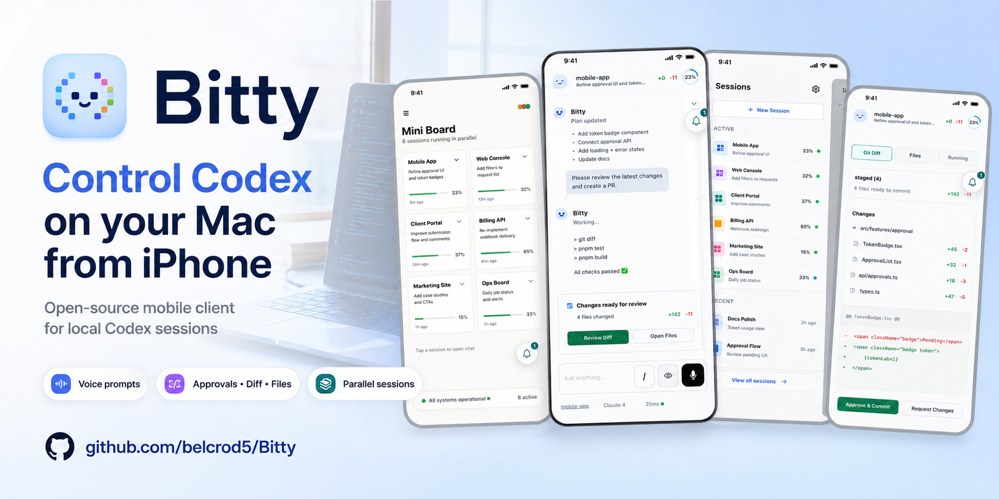
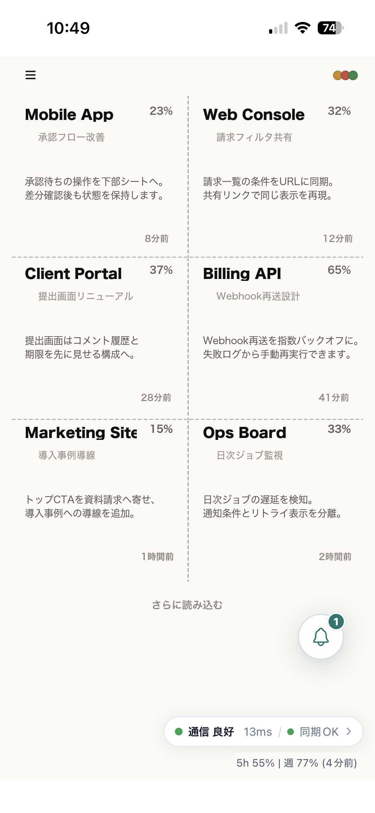
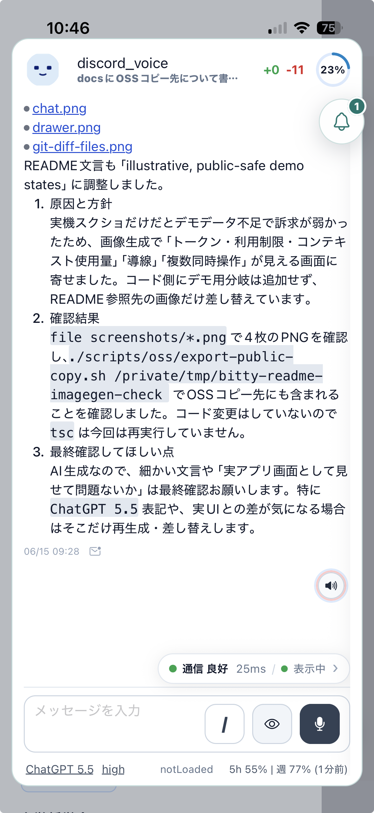
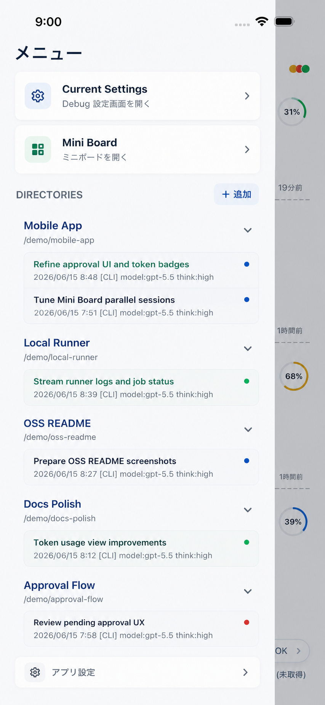
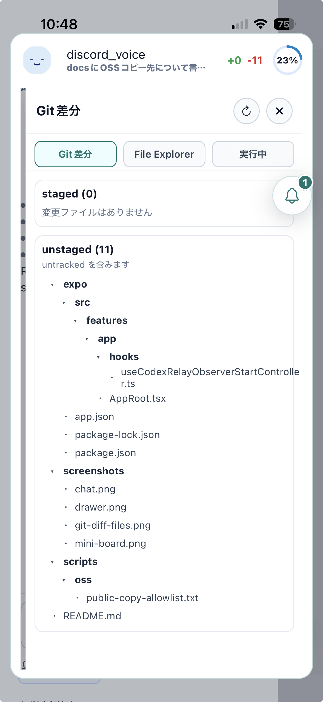

# Bitty

Bitty lets you operate Codex running on your macOS machine from an iPhone or
iPad. The iOS app connects to a local Node.js runner on your Mac, so you can
start or resume Codex sessions, speak prompts, review approvals, inspect files,
and monitor local coding work from your mobile device.

<p>
  
</p>

## Why Bitty Exists

Bitty started as a personal companion app for local AI-assisted development. The
original workflow used OpenClaw, but it did not expose enough control over the
working context, and it was hard to see what the assistant could see, remember,
or act on.

The goal of Bitty is to make that shared context more visible and controllable:
runtime state, token usage, session history, approvals, files, and speech
activity are surfaced in the mobile app so the human and the AI assistant can
work from a more aligned view of the task.

## Features

- Start, resume, and monitor Codex sessions running on your Mac from iOS.
- Talk to the runner with voice input, automatic recording, transcription, and
  optional auto-send.
- Play assistant replies through local or cloud text-to-speech, including
  streamable TTS playback.
- Use Mini Board to keep several directory-backed coding sessions visible at
  once.
- Browse directory session history, unread states, and recent runner activity
  from the mobile drawer.
- Keep token usage, runtime limits, and context usage visible while working.
- Review approval requests on the phone before local commands or tools
  continue.
- Inspect Git changes, workspace files, and running jobs without switching back
  to the desktop.
- Search and preview YouTube results when the runner is configured with the
  optional YouTube tools.
- Export and import app settings through the clipboard for device migration.

## How Bitty Differs From ChatGPT Codex Mobile

ChatGPT's Codex mobile experience is the official remote interface for Codex
tasks, threads, approvals, diffs, tests, terminal output, and cloud/remote
developer environments. Bitty is narrower: it is a local-first mobile companion
for a runner you control on your own machine.

| Area | ChatGPT Codex mobile | Bitty |
| --- | --- | --- |
| Primary role | Official Codex task and remote development surface | Mobile client for a local private runner |
| Runtime | OpenAI Codex remote environment and connected workspaces | Your Mac or local network runner |
| Interaction style | Task/thread review, approvals, diffs, logs | Voice input, TTS playback, chat, Mini Board, approvals |
| Visibility | Codex task state and remote run details | Token usage, runtime limits, context usage, and local runner state |
| Multi-task UX | Thread-oriented mobile access | Drawer, Mini Board, popup chat, and multiple sessions in parallel |
| Local tools | Remote connections and configured environments | Runner endpoints for local files, jobs, speech, and tools |
| Best fit | Managing Codex work from anywhere | Keeping a local coding assistant usable from a phone nearby |

## Screenshots

The screenshots below show illustrative, public-safe demo states used for the README.

<table>
  <tr>
    <td align="center" width="33%">
      
      <br />
      <sub>Mini Board</sub>
    </td>
    <td align="center" width="33%">
      
      <br />
      <sub>Chat</sub>
    </td>
    <td align="center" width="33%">
      
      <br />
      <sub>Runner Drawer</sub>
    </td>
  </tr>
  <tr>
    <td align="center" width="33%">
      
      <br />
      <sub>Git Diff And Files</sub>
    </td>
    <td width="33%"></td>
    <td width="33%"></td>
  </tr>
</table>

## Repository Layout

- `expo/`: Expo / React Native mobile app
- `private_runner/`: local runner service
- `scripts/`: development and device-build helper scripts
- `docs/`: repository workflow guides, including
  [Git worktree](docs/GIT-WORKTREE.md) and
  [code review](docs/CODE-REVIEW-GUIDE.md)
- `maestro/`: optional iOS simulator smoke-test flows

## Requirements

- Node.js
- npm
- Codex CLI (`codex`)
- Xcode for iOS builds
- Expo development tooling

Optional integrations such as Google Cloud TTS, YouTube API, ElevenLabs, and
local speech services are configured through `private_runner/.env`.

### Optional AivisSpeech

AivisSpeech is not required to run Bitty. It is only needed when you select
`aivisspeech` as the TTS provider.

When `ttsProvider=aivisspeech` is used, the runner expects a local macOS
AivisSpeech app/API at `http://127.0.0.1:10101`. If AivisSpeech is not installed
or cannot become ready, voice loading and speech synthesis fail with a runner
error instead of falling back silently to another provider. Use ElevenLabs or
Google Cloud TTS if you do not want to run AivisSpeech locally.

## Quick Start

1. Install the runner dependencies and create local config:

```bash
cd private_runner
npm install
cp .env.example .env
```

2. Edit `private_runner/.env` and set at least:

```env
RUNNER_TOKEN=replace-with-a-long-random-string
CODEX_HOME=$HOME/.codex
```

Generate a runner token with:

```bash
openssl rand -hex 32
```

Paste the generated value into `RUNNER_TOKEN`. For a real iOS device, also set
`HOST=0.0.0.0` so the runner accepts connections from your local network.

3. Log in to Codex for the runner:

```bash
node setup-codex-auth.mjs
```

For headless setup, use:

```bash
node setup-codex-auth.mjs --device-auth
```

4. Start the local runner:

```bash
./run-local.sh start --mode full
```

Useful runner commands:

```bash
./run-local.sh status
./run-local.sh restart --mode full
./run-local.sh stop --mode full
```

5. Install the mobile app dependencies:

```bash
cd ../expo
npm install
```

If the Bitty development build is not installed on the Simulator yet, build and
install it once:

```bash
npx expo run:ios --no-bundler
```

Run this command again after changing native dependencies. Then start Metro:

```bash
npx expo start --dev-client
```

In the app settings, set:

- iOS Simulator: `Runner URL = http://127.0.0.1:8788`
- Real device: `Runner URL = http://<your Mac LAN IP>:8788`
- `Runner Token`: the same value as `RUNNER_TOKEN` in `private_runner/.env`
- iOS Simulator:
  `Codex WS URL = ws://127.0.0.1:8788/runner-ws`
- Real device:
  `Codex WS URL = ws://<your Mac LAN IP>:8788/runner-ws`
- `Codex WS Token`: the same value as `RUNNER_TOKEN`; it is sent as `Authorization: Bearer <RUNNER_TOKEN>`, not as a URL query.

If Metro fails with a Watchman permission or stale-state error, reset Watchman
and restart Metro with a clean cache:

```bash
watchman watch-del-all
watchman shutdown-server
npx expo start --dev-client --clear
```

The runner writes local logs under `private_runner/logs/`. Logs and local auth
state are intentionally ignored by Git.

## Native iOS Builds

For iOS native builds, configure local signing/device settings outside Git:

```bash
cd ..
cp .env.ios.local.example .env.ios.local
```

Generate the native iOS project once after cloning or after native dependency
changes:

```bash
cd expo
npx expo prebuild --platform ios
cd ..
```

Set `IOS_DEVICE_ID` in `.env.ios.local`, then run:

```bash
./scripts/ios/build-expo-ios-device.sh
```

By default the public app identity is:

- App name: `Bitty`
- Expo slug: `bitty`
- iOS bundle identifier: `app.bitty.mobile`
- Settings file name: `bitty-settings.json`

## Settings Migration

The app includes clipboard-based settings export/import for complete
device-to-device migration.

The exported settings JSON can contain private data such as local URLs, paths,
session metadata, and approval rules. Do not publish exported settings files.
For OSS defaults, choose safe values manually in source code or example config
files.

## Optional Google Cloud Settings

Google Cloud is not required for the default local setup.

It is only used when you choose Google Cloud Text-to-Speech, or when YouTube
tools fall back to `gcloud` authentication instead of `YOUTUBE_API_KEY`.

```env
GOOGLE_CLOUD_PROJECT_ID=your-project-id
GOOGLE_CLOUD_TTS_LANGUAGE_CODE=ja-JP
GOOGLE_CLOUD_TTS_VOICE_NAME=ja-JP-Neural2-B
```

## Planned Features

These are not implemented yet:

- Push notifications for long-running tasks and approval requests.
- Siri shortcuts or voice commands for common app actions.
- Access to the local runner from outside the local network.

## Tests And Checks

```bash
cd expo
npx tsc --noEmit
```

```bash
cd ..
node --test private_runner/tests/*.test.mjs
```

The runner package currently does not define an `npm test` script; use the
Node.js test runner command above.

## Security

See `SECURITY.md`.

## License

MIT
