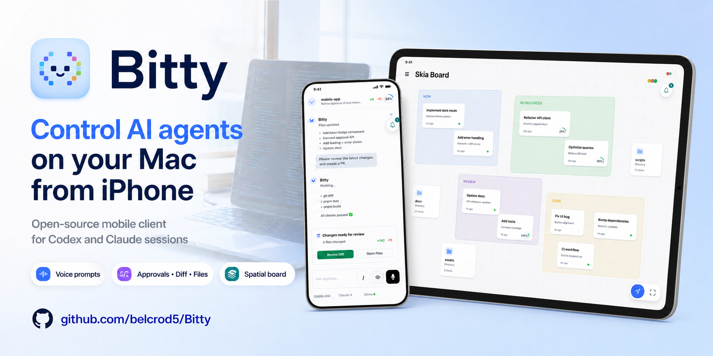
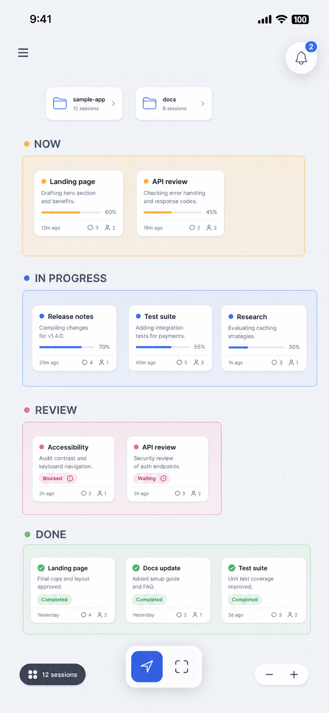
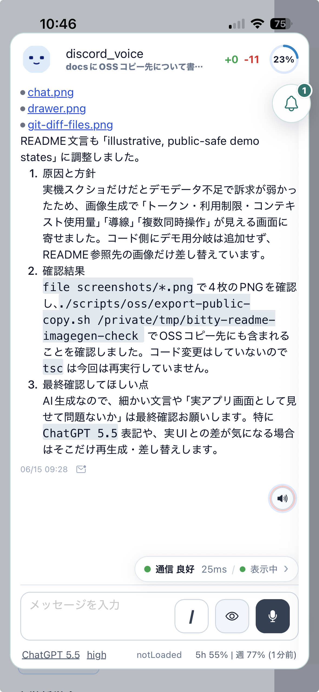
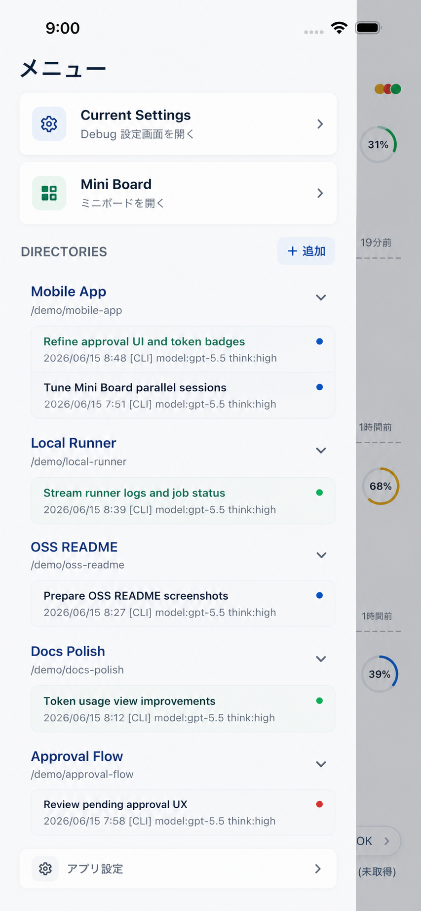
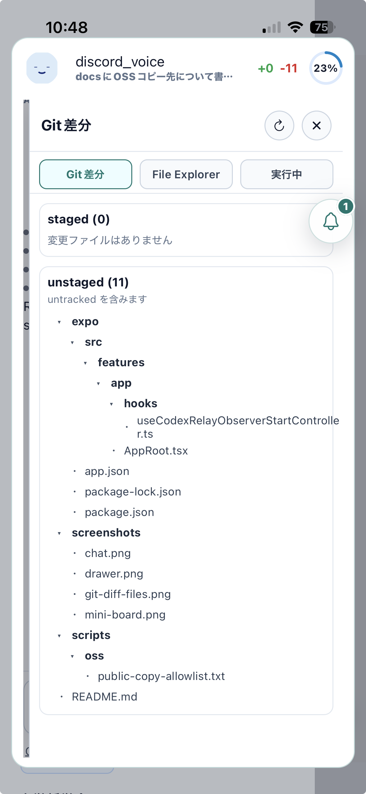

# Bitty

Bitty is a local-first mobile command center for AI agents running on your Mac.
It connects an iPhone or iPad to a private local runner and brings Codex and
Claude Code sessions into one visible workspace.

<p align="center">
  
</p>

## Why Bitty Exists

Sending a prompt is easy. Keeping track of several agents is not. Work spreads
across conversations and directories, approvals wait for attention, and it
becomes difficult to see what is running, what has finished, and where something
stopped.

Bitty makes that work visible. The app surfaces conversation history, live
activity, context usage, approvals, files, and local runner state so you can
understand what each agent is doing without reconstructing it from terminal
windows.

It is designed as a pocket view of the AI work happening on your computer: use
the larger board on an iPad, or check progress and respond from an iPhone while
away from your desk.

## Skia Board

Skia Board is the main workspace in Bitty. It is a zoomable, Figma-like canvas
where chat sessions, directories, and files can be placed freely instead of
being forced into a fixed list.

Create named, colored sections for any workflow that makes sense to you: active
work, waiting, review, blocked tasks, projects, teams, or something entirely
different. The board keeps the relationship between conversations and their
working directories visible, while each card remains a direct entry point into
the underlying session.

The board is deliberately flexible. It provides spatial organization and live
status without imposing a particular task-management method.

## Features

- Start, resume, and monitor Codex and Claude Code sessions running on your Mac.
- Arrange sessions, directories, and files freely on the zoomable Skia Board.
- Create, move, resize, label, and color sections to group work your own way.
- See recent activity, unread state, progress, context usage, and waiting
  approvals without opening every conversation.
- Browse session history grouped by working directory from the mobile drawer.
- Review approval requests before local commands or tools continue.
- Inspect Git changes, workspace files, and running jobs without returning to
  the desktop.
- Talk to the runner with voice input, automatic recording, transcription, and
  optional auto-send.
- Play assistant replies through local or cloud text-to-speech, including
  streamable TTS playback.
- Search and preview YouTube results when the runner is configured with the
  optional YouTube tools.
- Export and import app settings through the clipboard for device migration.

## Screenshots

The screenshots below show illustrative, public-safe demo states used for the README.

<p align="center">
  
  <br />
  <sub>Skia Board</sub>
</p>

<table>
  <tr>
    <td align="center" width="33%">
      
      <br />
      <sub>Chat</sub>
    </td>
    <td align="center" width="33%">
      
      <br />
      <sub>Runner Drawer</sub>
    </td>
    <td align="center" width="33%">
      
      <br />
      <sub>Git Diff And Files</sub>
    </td>
  </tr>
</table>

## Repository Layout

- `expo/`: Expo / React Native mobile app
- `private_runner/`: local runner service
- `scripts/`: development and device-build helper scripts
- `docs/`: repository workflow guides, including
  [Git worktree](docs/GIT-WORKTREE.md) and
  [code review](docs/CODE-REVIEW-GUIDE.md)
- `maestro/`: optional iOS simulator smoke-test flows

## Requirements

- Node.js
- npm
- At least one supported agent CLI:
  - Codex CLI (`codex` 0.145.0 or newer)
  - Claude Code CLI (`claude` 2.1.214 or newer)
- Xcode for iOS builds
- Expo development tooling

Optional integrations such as Google Cloud TTS, YouTube API, ElevenLabs, and
local speech services are configured through `private_runner/.env`.

### Optional AivisSpeech

AivisSpeech is not required to run Bitty. It is only needed when you select
`aivisspeech` as the TTS provider.

When `ttsProvider=aivisspeech` is used, the runner expects a local macOS
AivisSpeech app/API at `http://127.0.0.1:10101` and `ffmpeg` on the runner
host. The runner converts AivisSpeech WAV output to MP3 before serving it to the
client. If AivisSpeech or `ffmpeg` is not installed or cannot become ready,
voice loading and speech synthesis fail with a runner error instead of falling
back silently to another provider. Use ElevenLabs or Google Cloud TTS if you do
not want to run AivisSpeech locally.

## Quick Start

1. Install the runner dependencies and create local config:

```bash
cd private_runner
npm install
cp .env.example .env
```

2. Edit `private_runner/.env` and keep the default per-start runner token mode:

```env
RUNNER_TOKEN_MODE=random
RUNNER_PAIRING_QR=1
CODEX_HOME=$HOME/.codex
AGENT_CLAUDE_BINARY=claude
```

`CODEX_HOME` is used by Codex. `AGENT_CLAUDE_BINARY` can be left as `claude`
when Claude Code is available on `PATH`.

With `RUNNER_TOKEN_MODE=random`, `run-local.sh` generates a fresh
`RUNNER_TOKEN` on each start and passes it to the mobile app through a Pairing
QR. For a real iOS device on your local network, also set `HOST=0.0.0.0`.

Use a fixed token only for local debugging:

```env
RUNNER_TOKEN_MODE=env
RUNNER_TOKEN=replace-with-a-long-random-string
```

3. Authenticate the agent CLI or CLIs you want to use.

For Codex:

```bash
node setup-codex-auth.mjs
```

For headless setup, use:

```bash
node setup-codex-auth.mjs --device-auth
```

For Claude Code:

```bash
claude auth login
```

4. Start the local runner. Use `full` mode for Codex or for a mixed
Codex-and-Claude setup:

```bash
./run-local.sh start --mode full
```

For a Claude-only setup, the Codex app server is unnecessary:

```bash
./run-local.sh start --mode runner-only
```

Detached starts do not write the Pairing QR to logs. After the runner is
started, show the QR in your terminal:

```bash
./run-local.sh pairing-qr
```

Useful runner commands:

```bash
./run-local.sh status
./run-local.sh restart --mode full
./run-local.sh stop --mode full
```

Use `--mode runner-only` with restart and stop when running Claude only. Choose
Codex or Claude from Bitty's agent/model selector when starting a new session.

5. Install the mobile app dependencies:

```bash
cd ../expo
npm install
```

If the Bitty development build is not installed on the Simulator yet, build and
install it once:

```bash
npx expo run:ios --no-bundler
```

Run this command again after changing native dependencies. Then start Metro:

```bash
npx expo start --dev-client
```

In the app settings, either scan the Pairing QR from the left menu's
`Cloudflare Tunnel` screen, or set local values manually:

- iOS Simulator: `Runner URL = http://127.0.0.1:8788`
- Real device: `Runner URL = http://<your Mac LAN IP>:8788`
- `Runner Token`: the token from the Pairing QR, or the fixed `RUNNER_TOKEN`
  only when `RUNNER_TOKEN_MODE=env`
- iOS Simulator:
  `Codex WS URL = ws://127.0.0.1:8788/runner-ws`
- Real device:
  `Codex WS URL = ws://<your Mac LAN IP>:8788/runner-ws`
- `Codex WS Token`: normally the same runner token; it is sent as
  `Authorization: Bearer <RUNNER_TOKEN>`, not as a URL query.

If Metro fails with a Watchman permission or stale-state error, reset Watchman
and restart Metro with a clean cache:

```bash
watchman watch-del-all
watchman shutdown-server
npx expo start --dev-client --clear
```

The runner writes local logs under `private_runner/logs/`. Logs and local auth
state are intentionally ignored by Git.

## Native iOS Builds

For iOS native builds, configure local signing/device settings outside Git:

```bash
cd ..
cp .env.ios.local.example .env.ios.local
```

Generate the native iOS project once after cloning or after native dependency
changes:

```bash
cd expo
npx expo prebuild --platform ios
cd ..
```

Set `IOS_DEVICE_ID` in `.env.ios.local`, then run:

```bash
./scripts/ios/build-expo-ios-device.sh
```

By default the public app identity is:

- App name: `Bitty`
- Expo slug: `bitty`
- iOS bundle identifier: `app.bitty.mobile`
- Settings file name: `bitty-settings.json`

## Settings Migration

The app includes clipboard-based settings export/import for complete
device-to-device migration.

The exported settings JSON can contain private data such as local URLs, paths,
session metadata, and approval rules. Do not publish exported settings files.
For OSS defaults, choose safe values manually in source code or example config
files.

## Optional Google Cloud Settings

Google Cloud is not required for the default local setup.

It is only used when you choose Google Cloud Text-to-Speech, or when YouTube
tools fall back to `gcloud` authentication instead of `YOUTUBE_API_KEY`.

```env
GOOGLE_CLOUD_PROJECT_ID=your-project-id
GOOGLE_CLOUD_TTS_LANGUAGE_CODE=ja-JP
GOOGLE_CLOUD_TTS_VOICE_NAME=ja-JP-Neural2-B
```

## Tests And Checks

```bash
cd expo
npm run typecheck
npm test -- --runInBand
```

```bash
cd ..
node --test private_runner/tests/*.test.mjs
```

The runner package currently does not define an `npm test` script; use the
Node.js test runner command above.

## Security

See `SECURITY.md`.

## License

MIT
