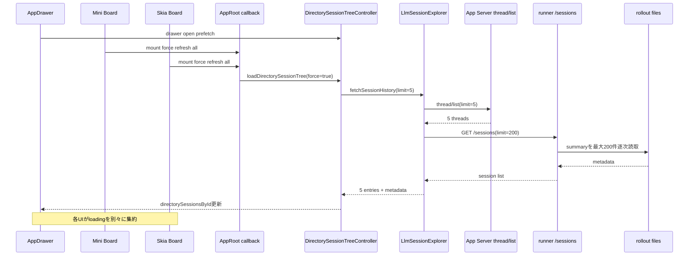
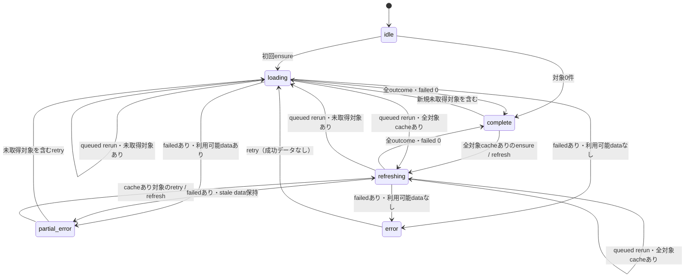

# セッション同期読み込み・進捗表示 実装設計

## 1. 文書情報

- 対象タスク:
  - 左ナビメニューのセッション同期プログレスバー
  - セッション一覧の根本的な読み込み方式の確認と是正
  - Mini Board / Skia Board への影響確認
- 対象ブランチ: `fix/session-sync-loading`
- ベース: `HEAD` / `origin/main` ともに `58814d0`
- 状態: 設計レビュー指摘反映済み・実装前
- この文書の目的:
  - UIごとの進捗表示追加ではなく、共有されるセッション取得ライフサイクルを正す
  - 表示件数に対して過剰なrunner読み込みを止める
  - 左ナビ、Mini Board、Skia Boardが同じ同期状態を同じ意味で利用できるようにする

## 2. 背景

現在、登録ディレクトリごとのセッション一覧は `directorySessionsById` に保存され、
左ナビ、Mini Board、Skia Boardから共有されている。

データ自体は共有されているが、取得の開始条件、実行中要求、進捗、完了判定は共有されていない。
各画面や復旧処理がそれぞれ再取得を開始でき、各UIは `loading` などの断片的な値から
独自に「同期中」を推測している。

また、1ディレクトリにつき画面で取得するセッションは5件であるのに、
付加メタデータの取得ではrunnerへ最大200件を要求している。
runnerは返却対象ごとにrolloutファイルからsummaryを読み直すため、
画面で必要な件数とファイルI/O量が一致していない。

結果として、次の問題が同じ原因から発生し得る。

- 左ナビを開いたときの読み込み終了時刻が分かりにくい
- 同じディレクトリの取得が複数画面から重複して開始される
- Skia Boardを開くだけで全登録ディレクトリの強制再取得が走る
- 既存データがあっても画面単位の `loading` 判定で待機表示になる
- 5件の一覧更新がrunner側の最大200件分のsummary読み込みに引きずられる
- 画面ごとに同期件数や完了の意味が異なる

## 3. 目的

### 3.1 機能目的

1. 登録ディレクトリのセッション同期について、全体の進捗を左ナビに表示する。
2. Mini BoardとSkia Boardも同じ同期状態を参照する。
3. 同一ディレクトリの同時取得を1つの実行中Promiseへ集約する。
4. 表示対象になったsession IDだけrunnerメタデータを取得する。
5. refresh中も取得済み一覧を保持する。
6. 一部失敗と全失敗を区別し、同期の終了を必ず判定できるようにする。

### 3.2 設計目的

1. UIコンポーネントに取得順序や再試行判断を置かない。
2. 画面ごとのrefresh処理とpending集約を削除する。
3. `AppRoot.tsx` と `private_runner/src/server-runtime.mjs` をさらに肥大化させない。
4. 新しい設定値を増やさず、現在のページサイズと同時実行数を取得契約へ反映する。
5. 既存の `/sessions` API利用者を壊さず、Expoは新しい単一経路へ切り替える。
6. 個別ディレクトリだけでなく、登録ディレクトリ同期サイクル全体も重複・競合させない。
7. ディレクトリ削除・identity統合・path canonicalizationを取得generationと同じ契約へ接続する。

## 4. 用語

- ディレクトリ同期:
  - 登録ディレクトリの先頭ページを取得し、`directorySessionsById` を更新する処理。
- 初回同期:
  - 対象ディレクトリに成功済みデータがない状態での同期。
- refresh:
  - 成功済みデータを保持したまま先頭ページを再取得する処理。
- load more:
  - `nextCursor` を使用して次ページを追加取得する処理。
  - 全体同期進捗には含めない。
- runner metadata:
  - `lastReadAt`、context usage、model、reasoning effortなど、
    App Serverのthread/listだけでは不足し得るメタデータ。
- panel hydration:
  - Mini Board / Skia Boardの候補セッションについてメッセージ本文を読み込み、
    panel snapshotを作る処理。
  - ディレクトリ同期とは別のライフサイクルとして扱う。
- 同期サイクル:
  - 複数の登録ディレクトリを対象にした1回のensureまたはrefresh実行。
- 同期drain:
  - 実行中サイクルと、その実行中に登録集合または強度が変わった場合の
    queued rerunを直列に処理し終えるまでの共有Promise。
- 対象集合revision:
  - 登録ディレクトリの `id + canonical path` の集合を識別する値。
  - 実行中サイクルの対象が現在の登録集合と一致するかを判定する。
- load outcome:
  - 1ディレクトリのensure/refreshが必ずresolveする
    `success | failed | skipped | superseded` の終端結果。

## 5. 対象範囲

### 5.1 対象

- 登録ディレクトリの先頭ページ取得
- runner metadataの結合
- 同一ディレクトリ取得の重複排除
- 登録ディレクトリ全体の同期進捗
- 左ナビの同期プログレスバー
- Mini Board / Skia Boardの同期状態参照
- 初回取得、TTL付きensure、明示refresh、auth復旧refresh
- 関連するログと自動テスト

### 5.2 対象外

- チャット本文のページング方式
- panel hydration内のメッセージページング
- セッション既読・未読mutation
- サブエージェント子セッションの展開UI
- Codex App Serverのthread/list仕様変更
- runner index全体の永続形式変更
- WebSocket接続状態表示そのもの
- ディレクトリ登録・削除UIの仕様変更

旧隣接ブランチ `fix/directory-read-progress-completion` は
`origin/main` の `58814d0` としてmerge済みである。
その `recordSessionReadDuringFetch`、read override、`directoryReadProgressByPath`、
既読プログレスUIとテストを前提として保持する。

## 6. 現行構成

### 6.1 共有状態

`expo/src/features/app/AppRoot.tsx`

- `directorySessionsById`
- `registeredDirectories`
- `expandedDirectoryIds`
- `DIRECTORY_SESSION_PAGE_SIZE = 5`
- `DIRECTORY_SESSION_PREFETCH_TTL_MS = 60 * 1000`
- `DIRECTORY_SESSION_PREFETCH_CONCURRENCY = 2`
- `DIRECTORY_SESSION_RUNNER_SNAPSHOT_LIMIT = 200`

`DirectorySessionTreeState` は現在 `AppDrawer.tsx` で定義されている。
取得ドメインの型がUIコンポーネントからexportされており、責務の向きが逆になっている。

### 6.2 左ナビからの経路

1. `AppRoot` の `drawerOpen` が `true` になる。
2. `useEffect` が `prefetchDirectorySessionTreesForDrawerOpen()` を呼ぶ。
3. `useDirectorySessionTreeController` がTTLと `loaded` を確認する。
4. 対象ディレクトリを選択済み優先で並べ、同時実行数2で取得する。
5. `loadDirectorySessionTree()` が `fetchSessionHistory()` を呼ぶ。
6. `AppDrawer` は各ディレクトリの `state.loading` を見て
   `ActivityIndicator` を表示する。

全ディレクトリを対象にした完了数、失敗数、全体進捗は存在しない。

### 6.3 Mini Boardからの経路

1. `MiniBoardScreen` が登録ディレクトリ一覧から
   `registeredDirectoryRefreshState` を独自に組み立てる。
2. mountまたは登録ディレクトリ構成変更時に
   `refreshRegisteredDirectorySessions()` を呼ぶ。
3. `AppRoot.refreshRegisteredDirectorySessionsForMiniBoard()` が
   全登録ディレクトリを `force: true` で並列取得する。
4. 取得後、候補セッションごとにpanel hydrationを行う。
5. `miniBoardDataSync` はディレクトリ取得状態とpanel hydration状態を合算する。

ディレクトリ一覧の同期とpanel hydrationが1つの「同期件数」に混在している。

### 6.4 Skia Boardからの経路

1. `SkiaMiniBoardScreen` が `useSkiaMiniChatSessions()` をmountする。
2. hookのmount effectが `refreshRegisteredDirectorySessions()` を呼ぶ。
3. 全登録ディレクトリが `force: true` で再取得される。
4. 最新6件を選び、各panelをhydrateする。
5. `loading` は各ディレクトリについて
   `!state || state.loading || state.loadingMore || !state.loaded`
   から算出される。
6. Skia画面下部に `同期中…` または表示件数を出す。

Skia側は共通キャッシュがTTL内でも、mountを理由に強制refreshする。

### 6.5 1ディレクトリのネットワーク・I/O経路

1. `useDirectorySessionTreeController.loadDirectorySessionTree`
2. `useLlmSessionExplorer.fetchSessionHistory`
3. `listCodexAppServerThreads`
4. runner WebSocket経由のApp Server `thread/list`
5. 最大5件のthreadを取得
6. `fetchRunnerSessionSnapshotMap`
7. runner HTTP `GET /sessions?directory=...&source=all&limit=200`
8. `private_runner/src/server-runtime.mjs:listLlmSessions`
9. ACP storeとCLI session indexから対象ディレクトリの候補を収集
10. 最大200件にslice
11. CLI sessionごとに `readCliSessionSummaryFromRolloutFile` を逐次await
12. summary内で先頭メッセージ、末尾context、metaをファイルから読む
13. Expo側でApp Server threadとrunner snapshotをsession IDで結合

表示対象5件よりrunner側の候補件数が大幅に多い。

## 7. 現行フロー図



## 8. 根本原因

### 8.1 確認済みの事実

1. `loadDirectorySessionTree` は実行中Promiseを保存していない。
2. 重複防止はrender時点の `directorySessionsById[directoryId].loading` に依存する。
3. 同じrender由来のcallbackが短時間に複数回呼ばれた場合、
   どちらも更新前stateを参照できる。
4. Drawer、auth復旧、Mini Board、Skia Boardに取得開始点が分散している。
5. Mini BoardとSkia Boardのmountは全ディレクトリを強制refreshできる。
6. App Server一覧5件の後にrunner一覧最大200件を取得する。
7. runnerの `listLlmSessions` は対象summaryをループ内で逐次awaitする。
8. 全体同期の状態型は存在しない。
9. Mini BoardとSkia Boardは同期状態を独自計算する。
10. panel hydrationとディレクトリ同期の件数がMini Boardで混在する。
11. 登録ディレクトリ全体の処理自体には共有中のPromiseがなく、
    Drawer、Mini Board、Skia Board、auth recoveryが別々の全件処理を開始できる。
12. ディレクトリ削除とidentity reconciliationはcontroller外から
    `directorySessionsById` を直接更新し、取得generationを無効化していない。

### 8.2 原因ごとの整理

#### 重複要求

取得中であることをstateの描画結果だけで判定している。
要求そのものを表すPromiseが共有されないため、
イベント順序によって同じ取得が複数開始される余地がある。

#### 過剰取得

App Serverで表示対象を決めた後に、runnerへ再び広い一覧を要求している。
runner metadataが必要なのは表示対象session IDだけであり、
一覧探索を二重に行う必要はない。

#### 進捗契約不在

per-directoryの `loading` はあるが、同期サイクルの対象数、
待機数、成功数、失敗数、終了状態がない。
このためUIがそれぞれ異なる集約を行っている。

#### 画面固有refresh

画面mountがデータ鮮度の判断を持つ。
画面遷移とデータrefreshが密結合し、キャッシュとTTLが活かされない。

#### race / stale closure

callbackが `directorySessionsById` に依存して再生成される一方、
非同期処理は開始時のclosureを使う。
遅い古い応答を破棄するgenerationもないため、
path変更や連続force refresh時に新しい結果を上書きする余地がある。

さらに、単一ディレクトリのgenerationだけを追加しても、
登録ディレクトリ全体の同期サイクル同士が並行すれば、
古いサイクルの進捗更新が新しいサイクルを上書きし得る。
サイクルをまたいだ同時実行数も2を超え得る。

削除・identity統合・canonical path変更時はstateがcontroller外で変更される。
取得応答時にgenerationだけでなく「現在も同じID/pathが登録済みか」を確認しなければ、
削除済みstateを遅延応答が再作成できる。

#### エラー・完了判定

各directory stateはエラーを持つが、全ディレクトリ処理の終了を表す値がない。
一部失敗を「同期継続中」と「同期完了・一部失敗」に分けられない。

### 8.3 未計測の仮説

- 体感上の待ち時間の大部分がrunner `/sessions` のsummary読取である
- 画面遷移直後に同一ディレクトリのHTTP/WS要求が重複している
- 登録ディレクトリ数が多いほど200件summary取得の累積時間が支配的になる

UIタイマーで隠さず、要求件数、dedupe回数、各phase所要時間を計測する。

## 9. 設計原則

1. 取得開始、重複排除、鮮度判断、進捗を同じcontrollerに集約する。
2. UIは共通状態を表示するだけにする。
3. App Serverで決まった表示対象session IDをrunner metadata取得の入力にする。
4. refresh中はstale-while-revalidateとして既存一覧を保持する。
5. load moreとpanel hydrationは全体同期進捗へ混ぜない。
6. request generationで遅い応答を破棄する。
7. 一部失敗でも同期サイクルを必ずterminal stateへ進める。
8. 新しい抽象は複数の実利用箇所があるものだけにする。
9. 既存の巨大ファイルへ新しい業務ロジックを追加しない。
10. controllerはアプリstate全体ではなく、セッション取得ライフサイクルだけを所有する。
11. 登録同期は1つのdrainへ集約し、対象変更は並行実行ではなくqueued rerunにする。
12. 取得結果を例外と `void` の混在で表さず、共通outcomeで終端まで追跡する。

## 10. 採用する全体構成

### 10.1 Expo側

既存 `useDirectorySessionTreeController` をセッション取得ライフサイクルの唯一の所有者にする。

ここでいう所有対象は、取得の開始判断、TTL、実行中Promise、実行順、
generation、結果適用可否、登録同期サイクル、進捗である。
登録ディレクトリの永続化、表示名・色、identity確認、panel stateなど
アプリstate全体をcontrollerへ移す意味ではない。

controllerが次を返す。

- 単一ディレクトリのensure/refreshと、その `DirectoryLoadOutcome`
- 登録ディレクトリ全体のensure/refreshと、共有されるdrain Promise
- load more
- child history load
- 共通の `directorySessionSync`
- 削除・identity変更時に取得を無効化するlifecycle操作

`AppRoot` はcontrollerの戻り値をContextへ渡すだけにする。
Mini Board / Skia Board用の全件force refresh callbackは削除する。
新しいmanager classや、controllerを転送するだけのhookは作らない。

### 10.2 runner側

App Serverの結果に含まれるsession IDだけを受け取るbatch summary APIを追加する。
runnerでは新しい `llm-session-service.mjs` が既存一覧と新しいbatch summaryの
両方を所有する。既存 `listLlmSessions` の一覧結合・summary付与処理も
`server-runtime.mjs` から同serviceへ移し、巨大ファイルを純減させる。

採用API:

```http
POST /session-summaries
Authorization: Bearer <runner-token>
Content-Type: application/json

{
  "directory": "/absolute/workspace",
  "sessionIds": ["id-1", "id-2", "id-3"]
}
```

成功応答:

```json
{
  "directory": "/absolute/workspace",
  "sessions": [
    {
      "sessionId": "id-1",
      "source": "cli",
      "lastReadAt": "2026-07-29T00:00:00.000Z",
      "firstUserMessage": "prompt",
      "contextUsage": {},
      "modelRef": "gpt-5",
      "reasoningEffort": "high"
    }
  ],
  "missingSessionIds": ["id-3"]
}
```

### 10.3 API選定理由

`GET /sessions?limit=5` は採用しない。

- App Serverとrunnerで並び順・source集合が完全一致する保証がない
- 必要なsession IDがrunner側先頭5件に含まれない可能性がある
- limitを小さくするだけでは結合欠落を説明できない

session IDごとの `/session-messages` 呼び出しも採用しない。

- 5件分のHTTP N+1になる
- 本文APIと一覧metadata APIの責務が混ざる
- context以外の一覧用metadata取得意図が不明瞭になる

既存 `/sessions` の破壊的変更も行わない。

- 他の利用箇所との互換性を維持する
- Expoとrunnerは同じworktreeから同時更新する
- Expoには旧runner向け404 fallbackを追加しない
- rollback時はアプリとrunnerを同じ変更単位で戻す

## 11. Expo側の型設計

### 11.1 型の配置

`DirectorySessionTreeState`、`SessionChildTreeState`、`DirectoryReadProgress`、
`RegisteredDirectoryEntry`、`DirectoryMarkerColor` を
`AppDrawer.tsx` から取得ドメインの型ファイルへ移す。

候補:

`expo/src/features/app/types/directorySessions.ts`

これは単なる転送ファイルではない。
複数hook、Context、Drawer、Mini Board、Skia Boardで共有する
セッション取得契約の所有場所とする。

### 11.2 per-directory state

```ts
export type DirectorySessionTreeState = {
  loading: boolean;
  refreshing: boolean;
  loadingMore: boolean;
  loaded: boolean;
  fetchedAtMs: number;
  error: string;
  latestSessionId: string;
  nextCursor: string;
  hasMore: boolean;
  entries: LlmSessionHistoryEntry[];
  childrenByParentId: Record<string, SessionChildTreeState>;
};
```

`loading` は初回取得だけを表す。
既存データを持つ再取得は `refreshing` で表す。

これにより、refresh中に一覧を空表示へ戻さず、
UIが初回skeletonとバックグラウンドrefreshを区別できる。

### 11.3 全体同期state

```ts
export type DirectorySessionSyncPhase =
  | "idle"
  | "loading"
  | "refreshing"
  | "complete"
  | "partial_error"
  | "error";

export type DirectorySessionSyncState = {
  cycleId: number;
  targetRevision: number;
  requestedMode: "ensure" | "refresh";
  phase: DirectorySessionSyncPhase;
  totalCount: number;
  pendingCount: number;
  activeCount: number;
  succeededCount: number;
  skippedCount: number;
  failedCount: number;
  supersededCount: number;
  completedCount: number;
  usableCountAfterCycle: number;
  progress: number;
  startedAtMs: number;
  completedAtMs: number;
};
```

`succeededCount` はネットワーク取得が成功してstateへ適用された件数だけを表す。
TTL内で取得不要だった対象は `skippedCount`、削除・path変更・新generationで
適用されなかった対象は `supersededCount` とし、成功へ偽装しない。

### 11.4 単一ディレクトリのload outcome

初回取得とrefreshの公開Promiseはreject/`void`/state返却を混在させず、
必ず次のunionをresolveする。

```ts
export type DirectoryLoadOutcome =
  | {
      status: "success";
      directoryId: string;
      directoryPath: string;
      state: DirectorySessionTreeState;
    }
  | {
      status: "failed";
      directoryId: string;
      directoryPath: string;
      error: string;
      hasUsableData: boolean;
    }
  | {
      status: "skipped";
      directoryId: string;
      directoryPath: string;
      reason: "fresh" | "not_registered";
      hasUsableData: boolean;
    }
  | {
      status: "superseded";
      directoryId: string;
      directoryPath: string;
      reason: "newer_request" | "path_changed" | "removed" | "identity_merged";
    };
```

意味:

- `success`: 応答が現在のgeneration・登録ID・canonical pathと一致し、stateへ適用済み。
- `failed`: 現在の要求が通信・解析エラーで終わり、エラーstateまで適用済み。
- `skipped/fresh`: ensure対象がTTL内で、意図どおり通信しなかった。
- `skipped/not_registered`: queueから取り出す前に未登録になり、通信を開始しなかった。
- `superseded`: 通信開始後に対象identityまたはgenerationが変わり、応答を適用しなかった。

fetchエラーは `failed` に変換する。想定外のprogramming errorを握り潰すための
広域catchは置かないが、同期対象1件の失敗でworker/drainをrejectさせない。
in-flight Mapの型も `Promise<DirectoryLoadOutcome>` とし、
呼び出し元と内部Mapで異なるPromise型を持たない。

### 11.5 progress定義

```ts
completedCount =
  succeededCount + skippedCount + failedCount + supersededCount
progress = totalCount === 0 ? 1 : completedCount / totalCount
pendingCount = totalCount - activeCount - completedCount
```

不変条件:

- すべてのcountは0以上の整数
- `completedCount <= totalCount`
- `pendingCount + activeCount + completedCount === totalCount`
- `0 <= progress <= 1`
- terminal phaseでは `pendingCount === 0` かつ `activeCount === 0`
- 各対象は4つのoutcomeのどれか1つだけへ一度だけcountされる
- fresh skipも完了数へ含め、ensureが永遠に未完了にならない
- `usableCountAfterCycle` は対象snapshotのうち、terminal時点で
  過去または今回の成功結果（0件という正常結果を含む）を持つ件数である。
  `loaded === true` かつ成功時 `fetchedAtMs` を持つことを基準にし、
  entriesが空という理由でerror扱いにしない

### 11.6 phase決定

| 条件 | phase |
|---|---|
| 同期サイクル未実行 | `idle` |
| 実行開始時に利用可能データがない対象を1件以上含む | `loading` |
| 全対象が利用可能データを持つ状態で実行中 | `refreshing` |
| terminalかつ `failedCount === 0` | `complete` |
| terminalかつ失敗あり、`usableCountAfterCycle > 0` | `partial_error` |
| terminalかつ失敗あり、`usableCountAfterCycle === 0` | `error` |
| 対象0件で実行 | `complete` |

初回対象とrefresh対象が混在するサイクルは `loading` とする。
これは「少なくとも1ディレクトリは初回データを待っている」という
ユーザー影響を優先するためである。`requestedMode` は別フィールドに保持するため、
診断上ensure/refreshの依頼種別は失われない。

全refreshが通信失敗してもstale dataを保持できた場合は `partial_error` であり、
`error` ではない。逆に、通信成功が1件あっても現在の登録対象に利用可能データが
1件も残らなければ `error` とする。phaseを単純な成功件数だけで決めない。

対象0件は処理上完了だが、UI文言は
「登録ディレクトリなし」とする。

## 12. 共有取得ライフサイクル

### 12.1 controller公開API

```ts
type DirectorySessionSyncReason =
  | "drawer_open"
  | "screen_mount"
  | "manual_refresh"
  | "auth_recovery"
  | "session_completed"
  | "registered_targets_changed";

ensureDirectorySessionTree(
  directory: RegisteredDirectoryEntry,
  reason: DirectorySessionSyncReason
): Promise<DirectoryLoadOutcome>;

refreshDirectorySessionTree(
  directory: RegisteredDirectoryEntry,
  reason: DirectorySessionSyncReason
): Promise<DirectoryLoadOutcome>;

ensureRegisteredDirectorySessions(
  reason: DirectorySessionSyncReason
): Promise<void>;

refreshRegisteredDirectorySessions(
  reason: DirectorySessionSyncReason
): Promise<void>;

prepareDirectorySessionTargetChange(params: {
  nextRegisteredDirectories: RegisteredDirectoryEntry[];
  transitions: Array<
    | { kind: "same_identity"; fromId: string; toId: string; fromPath: string; toPath: string }
    | { kind: "replace"; directoryId: string; fromPath: string; toPath: string }
    | { kind: "remove"; directoryId: string; fromPath: string }
  >;
}): void;
```

`force: boolean` は呼び出し側へ公開しない。
ensure/refreshを別名にし、呼び出し時点で意味を限定する。

- `ensure`
  - 未取得またはTTL切れなら取得
  - TTL内なら `skipped/fresh` を返す
- `refresh`
  - TTLに関係なく再取得
  - ただし同じkeyの実行中Promiseがあればそれを共有する

`reason` はログだけに使い、TTLや強制実行を分岐させない。
`prepareDirectorySessionTargetChange` はsetterを転送するwrapperではない。
identityの同一性に応じたtree保持/破棄、ref同期、generation無効化、
対象revision更新、latest target setのrerunを1つの順序で行う。

### 12.2 in-flight key

```ts
key = `${directory.id}\u0000${normalizedDirectoryPath}`
```

同じIDでもpathが変更された場合は別要求として扱う。
同じpathを別IDで重複登録する仕様は現在ないため、
異なるID間でのネットワークPromise共有は行わない。

### 12.3 Promise共有

controller内に次を持つ。

```ts
const inFlightByKeyRef =
  useRef(new Map<string, Promise<DirectoryLoadOutcome>>());
```

処理順:

1. keyを計算する。
2. `inFlightByKeyRef` にPromiseがあれば返す。
3. ensureなら最新stateとTTLを確認する。
4. generationを進める。
5. UI stateを `loading` または `refreshing` にする。
6. global fetch slotの待機を含むPromiseをMapへ登録する。
7. slot取得後に `fetchSessionHistory` を開始する。
8. 成功または失敗をstateへ反映する。
9. generation・登録ID・canonical pathが変わっていればstateを更新せず
   `superseded` を返す。
10. 登録時と同じPromiseである場合だけMapから削除する。

PromiseをMapへ入れてからawaitする。
これにより同じイベントループ内の2呼び出しも共有できる。
`58814d0` で追加されたactive fetchごとのread override Mapは削除せず、
共有Promiseが所有する。fetch中の既読mutationは成功応答へ再適用し、
新しいrunner metadataで `lastReadAt` を巻き戻さない。
load more / child fetchのread overrideも現行どおり維持する。

### 12.4 generation

```ts
const requestGenerationByDirectoryIdRef = useRef(new Map<string, number>());
const registeredDirectoryPathByIdRef = useRef(new Map<string, string>());
const registeredDirectoriesRef = useRef<RegisteredDirectoryEntry[]>([]);
```

新規ネットワーク要求を開始するときだけgenerationを加算する。
応答時に開始時generationと現在generationを比較する。

応答適用条件:

1. 開始時generationと現在generationが一致する。
2. `registeredDirectoryPathByIdRef` にdirectory IDが残っている。
3. 同refのpathと要求開始時canonical pathが一致する。

1つでも不一致なら:

- `directorySessionsById` を更新しない
- updater内でも同条件を再確認し、削除済みkeyを再作成しない
- 新しい要求のloading状態を変更しない
- 診断ログへ `superseded: true` を出す
- Promiseはrejectさせず、理由付き `superseded` を返す

### 12.5 stale closure対策

鮮度判定用の最新stateはrefにも同期する。

```ts
const directorySessionsByIdRef = useRef(directorySessionsById);
directorySessionsByIdRef.current = directorySessionsById;
```

ただし重複排除の第一手段はstate refではなくin-flight Mapとする。
refはTTL、loaded、path変更判断に使う。

### 12.6 登録同期drainの共有

単一directoryのin-flight共有だけでは全体同期同士の競合を防げないため、
controllerは登録同期全体について次のrefを持つ。

```ts
const registeredSyncDrainPromiseRef = useRef<Promise<void> | null>(null);
const activeRegisteredCycleRef = useRef<{
  cycleId: number;
  targetRevision: number;
  targetKey: string;
  mode: "ensure" | "refresh";
} | null>(null);
const queuedRegisteredSyncIntentRef = useRef<{
  targetRevision: number;
  targetKey: string;
  mode: "ensure" | "refresh";
  reasons: Set<DirectorySessionSyncReason>;
} | null>(null);
```

`targetKey` は現在の登録ディレクトリを `id + canonical path` で安定sortして作る。
表示順変更だけではrevisionを変えず、ID/pathの追加・削除・変更で変える。
各cycleは開始時に `registeredDirectoriesRef` から対象snapshotを作り、
途中のReact render closureを参照しない。

controller自身が各renderの正規化target snapshot/keyを前回keyと比較する。
初回renderでは監視基準だけを保存し、それ以降の追加・削除・path変更では:

1. 最新target/refとpath mapを更新し、target revisionを進める。
2. 削除はtreeを除き、未通知path変更は `replace` として旧tree/refを同期破棄する。
3. affected IDのgenerationを進める。
4. latest target setのensure intentをqueueする。
5. drainが終了済みでも同じhelperで新drainを開始する。

したがって登録追加は画面mount effectやcallerの明示syncを必要としない。
`prepareDirectorySessionTargetChange` はidentity確定情報とReact setter前の
同期ref更新を渡す経路、render監視は通常追加と通知漏れを安全側で補足する経路である。
事前通知済みkeyを監視effectが再検出してもrevision/rerunを重複させない。

呼び出し規則:

1. drainがなければintentをqueueし、1つのdrain Promiseを作る。
2. drain実行中で対象集合と要求強度がactive cycleに包含される場合、
   新しいcycleを作らず同じdrain Promiseへjoinする。
3. 対象集合が変わった場合、現在cycleをcancelせず、
   最新集合のrerunを1件だけqueueする。
4. activeがensureで新しい要求がrefreshの場合、refresh rerunをqueueする。
5. activeがrefreshで対象集合が同じ場合、ensure/refreshともactiveへjoinする。
6. queued intentが複数回更新された場合、最新対象集合を採用し、
   modeは強い方のrefreshを保持する。
7. cycle終了後、queued intentがあれば同じdrain内で次cycleを直列実行する。
8. queueが空になったときだけdrain refをnullにする。

これによりDrawer、Mini Board、Skia Board、auth recoveryが同時に呼んでも、
登録同期drainは1本だけになる。対象集合変更時も旧cycleと新cycleを並行させない。

### 12.7 cycleId guard

cycle開始ごとに単調増加する `cycleId` を払い出す。
progress更新は常に次の形に限定する。

```ts
setDirectorySessionSync((current) => (
  current.cycleId === cycleId
    ? applyOutcomeToSyncState(current, outcome)
    : current
));
```

旧cycleのworker完了が遅れても、新cycleのcount/phaseを更新しない。
queued rerunがある場合、旧cycleのterminal stateを長時間公開せず、
同じdrainの次cycle開始stateへ直ちに置き換える。

cycle内の各対象は `DirectoryLoadOutcome` を一度だけ集計する。
`Promise.allSettled` のrejected件数から成功/失敗を推測しない。

### 12.8 全呼び出しで共有する最大2並列queue

最大2並列は「1つのcycleあたり」ではなく、
controllerから開始される先頭ページfetch全体の上限とする。

```ts
const activeDirectoryFetchCountRef = useRef(0);
const waitingDirectoryFetchesRef = useRef<Array<() => void>>([]);
```

- 登録同期cycle
- 単一ディレクトリのsession completion refresh
- Drawer等の単一ensure

のすべてが同じslot取得・解放処理を通る。
新しいclassや設定項目は作らず、既存
`DIRECTORY_SESSION_PREFETCH_CONCURRENCY = 2` をcontroller引数として使う。

fresh skipと未登録skipはslotを消費しない。
MapへPromiseを登録してからslotを待つため、待機中の同一key要求もdedupeされる。
slotは `finally` で必ず解放し、失敗やsupersededで枯渇させない。

登録cycleは最大2 workerでoutcomeを待つが、実ネットワーク開始はさらに
global slotで制限する。別cycleはdrainにより直列であり、
単一directory要求が重なっても全体の実fetch数は2を超えない。

### 12.9 refresh中のstate

既存 `entries`、cursor、childrenを保持する。

refresh開始:

```ts
{
  ...previous,
  loading: !previous.loaded,
  refreshing: previous.loaded,
  loadingMore: false,
  error: ""
}
```

refresh成功:

- 先頭ページentriesを置換
- cursorを新しい先頭ページの値に置換
- `childrenByParentId` は維持
- `loading=false`
- `refreshing=false`
- `fetchedAtMs=Date.now()`

refresh失敗:

- 既存entriesとcursorを維持
- `loaded` は以前の値を維持
- `error` を設定
- `loading=false`
- `refreshing=false`
- 失敗時刻を成功時刻として `fetchedAtMs` に入れない

現在の失敗処理のように、取得済みentriesを空配列へ戻さない。

### 12.10 load more

load moreは以下を維持する。

- `nextCursor` を使う
- 既存session IDを除外してappendする
- `loadingMore` で個別表示する

追加ルール:

- `loading` または `refreshing` 中ならload moreを開始しない
- load more実行中に明示refreshされた場合、refreshを優先する
- refresh generationが変わった後に古いload moreが返った場合は破棄する
- load moreは全体同期progressへ含めない
- load moreのmetadataも、そのページで返ったsession IDだけbatch取得する

Drawerの「さらに読み込む」disabled判定も
`loading || refreshing || loadingMore` とする。
controllerだけでno-opにせず、`useAppDrawerSessionController.ts` と
`AppDrawer.tsx` でも押下不可を表し、二重tapや誤ったenabled表示を防ぐ。

### 12.11 登録削除・path変更・identity統合

controllerは登録state全体を所有しないが、取得応答の適用可否は所有する。
stateを保持できるのはrunnerの `/directories` 応答と
`reconcileRegisteredDirectories` により同一canonical実体と確認できた場合だけとする。

- `same_identity`: alias canonicalizationと、同じcanonical pathへ収束した重複ID統合。
  retained IDの既存treeを優先し、ない場合だけremoved IDのtreeを移送する。
  entry/childのdirectoryをcanonical pathへ書き換えて保持する。
- `replace`: 別実体へのpath置換、または同一性を証明できない変更。
  IDが同じでもtree、cursor、children、成功時刻を破棄して新keyをensureする。
- `remove`: treeを破棄し、遅延応答を `superseded/removed` にする。

`useDirectoryIdentityReconciliation.ts` は
`canonicalPathByPath` と `retainedIdByRemovedId` から `same_identity` transitionを作る。
それ以外のpath差分を同一identityと推測しない。

React setter直後のensureが旧refをTTL freshと判定しないよう、順序を固定する。

1. current refsから保持/破棄後のtree snapshotを同期的に作る。
2. `registeredDirectoriesRef`、path map、`directorySessionsByIdRef` をnextへ代入する。
3. affected generationとtarget revisionを進める。
4. Reactのsession tree setter、registered directories setterを呼ぶ。
5. latest target setのensure rerunをqueueする。

`AppRoot.removeRegisteredDirectory` もsetter前に同APIを呼ぶ。
render監視で直接path置換を検出した場合は `replace` として同じ順序を実行する。
応答時のgeneration・登録ID・path再照合により削除treeを再作成しない。

### 12.12 unmount

controllerはAppRoot配下でアプリ存続中mountされるため、
画面遷移では破棄されない。

AppRoot unmount時:

- React state更新を行わないdisposed flagを設定
- ネットワークcancelが可能なAPIには将来対応できるが、
  今回はPromise共有と結果破棄を完成条件とする

### 12.13 auth未準備

- settings未ロード中に画面mountを理由としたforce refreshは行わない
- ensureが認証前に失敗した場合、エラーをterminalとして記録する
- 既存のauth recoveryは共有
  `refreshRegisteredDirectorySessions("auth_recovery")` を1回呼ぶ
- recoveryも既に同じ要求が実行中ならPromiseを共有する
- runner metadataだけ認証不足の場合はApp Server一覧を成功として返し、
  metadata欠落をディレクトリ同期失敗にしない

### 12.14 session completion後の対象refresh

現在の `refreshMiniBoardDirectorySessionsForDirectory` は
`activeScreen === "mini_board"` のときだけ全件処理とは別のforce APIを呼ぶ。
これを削除し、`handleLlmMessageCompleted` から登録済み対象1件だけ
`refreshDirectorySessionTree(target, "session_completed")` へ接続する。

- Mini Board専用名・screen条件を削除する
- 未登録directoryは既存どおり診断ログだけで終了する
- 同じdirectoryが実行中ならin-flight Promiseを共有する
- 他directoryまでrefreshしない
- global最大2並列queueを通る
- 登録同期progressへは新しい全件cycleとして混ぜない
- 成功stateはDrawer / Mini Board / Skia Boardすべてへ即時共有される

### 12.15 cycle workerとoutcome集計

登録ディレクトリ全体は現在どおり最大2並列とする。
新しい設定値は追加しない。

同期サイクル内のwork distributionで:

1. 対象を選択済みディレクトリ優先で並べる。
2. worker 2個で処理する。
3. worker開始時にpendingを1減らしactiveを1増やす。
4. settle時にactiveを1減らし4種outcomeの対応countを1増やす。
5. 全worker終了時にterminal phaseを決める。

fresh targetも対象snapshotには含め、worker内で `skipped/fresh` として完了させる。
対象を事前filterしてtotalから消さない。これにより「登録5件、うち3件fresh」のensureは
`total=5, skipped=3` と説明できる。

`superseded` は失敗に数えない。対象変更時はqueued rerunが最新集合を同期するため、
旧cycleのsupersededを新cycleの成功扱いにも流用しない。

## 13. 変更後の状態遷移



`skipped` と `superseded` はそれ自体ではerror phaseを作らない。
queued rerunがある旧cycleのterminal結果は診断ログへ残すが、
UI stateは同じdrain内の新cycleへ直ちに進める。

## 14. runner metadata取得設計

### 14.1 入力制約

- `sessionIds` は必須配列
- 空配列は200で空結果
- request bodyは `readJsonBody(req, 32 * 1024)` で最大32KiB
- 配列要素は文字列だけを許可し、objectの暗黙文字列化はしない
- 各IDはtrim後、既存 `normalizeLlmExecutionSessionId` を通す
- 各IDは既存上限120文字・既存許可文字 `[A-Za-z0-9._:-]` を再利用する
- 空IDまたは不正IDが1件でもあれば、index付き400 `invalid_session_id`
- 入力順を保って重複IDを除外
- raw配列・dedupe後配列とも最大100件
- 超過は400 `too_many_session_ids`
- `directory` は既存と同じcanonical identity解決を行う
- `directory` が空の場合は既定rootへ暗黙fallbackせず400
- JSON構文不正、配列以外、body超過はそれぞれ400として返す

通常のページサイズは5件であり、100件上限はAPI防御である。
32KiB、100件、120文字、後述worker数は固定値とし、
環境変数や新しい設定画面を増やさない。

### 14.2 index lookup

`llm-cli-session-index.mjs` にbatch lookupを追加する。

```js
findCliSessionIndexEntriesBySessionIds(sessionIds, { directory })
```

要件:

- `refreshCliSessionIndex()` はbatch全体で1回だけ実行
- session ID集合を作る
- indexを1走査する
- 既存 `cliSessionEntryMatchesDirectoryIdentity` でcanonical directory identityを照合する
- 同一session ID候補は既存比較規則で最新を選ぶ
- 入力session ID順で結果を返す
- requestにないentryや別directoryの同一IDを返さない

1 IDごとに既存 `findCliSessionIndexEntryBySessionId` を呼ぶ実装は避ける。
index refreshと走査のN回実行になるためである。

### 14.3 summary読み込み

選択されたentryだけ `readCliSessionSummaryFromRolloutFile` を呼ぶ。

- 通常最大5件
- 固定6 workerでbounded parallel read
- 100件入力でも同時open/readは最大6
- worker数6は設定化せず、4〜8の固定範囲に収める
- 1件の読取失敗はそのIDをmissing扱いにし、batch全体を500にしない
- canonical directory不正、認証不正、body不正はrequest全体を失敗させる

100件 `Promise.all` や汎用worker pool classは作らず、
service内の固定cursor + 6 workerで完結させる。

### 14.4 runner service責務

新規 `private_runner/src/llm-session-service.mjs` は次の2操作を所有する。

```js
const {
  listLlmSessions,
  getLlmSessionSummaries,
} = createLlmSessionService(dependencies);
```

`listLlmSessions`:

- 既存ACP/CLI一覧を取得
- 既存sort・limitを適用
- CLI rollout summaryを固定6 workerで付与
- filePathをresponseから除外
- 現行 `/sessions` responseを維持

`getLlmSessionSummaries`:

- bodyのdomain validation
- canonical directory内のACP一覧を1回取得
- CLI indexを1回refresh・1回走査
- requested IDだけsummary読取
- ACP/CLI metadataをsession IDごとに結合
- 入力ID順でsessions/missingSessionIdsを返す

routeは認証、32KiB body読取、service呼び出し、HTTP error変換だけを行う。
一覧・summary・mergeの業務処理を `server-runtime.mjs` に残さない。
body超過とJSON parse errorはroute境界で既存 `makeApiError` 相当の
400 payloadへ変換し、汎用500へ落とさない。
既存 `listLlmSessions` をserviceへ移すことで、route追加分を差し引いても
`server-runtime.mjs` は純減させる。

### 14.5 ACP / CLIの同一session ID結合

batch APIはCLIだけでなくACP storeも参照する。
これは既存 `/sessions?source=all` から得ていた `lastReadAt` を失わないために必要である。

directory scope内でIDごとに次を適用する。

| 存在 | response |
|---|---|
| CLIのみ | CLI index + rollout summary |
| ACPのみ | ACPのupdatedAt/lastReadAt、summary固有fieldは空 |
| CLIとACPの両方 | CLIの豊富なsummaryを基準にし、lastReadAtは両sourceの新しい方 |
| どちらにもない | `missingSessionIds` |

同一IDのfield規則:

- `source`: CLIがあれば `"cli"`、ACPだけなら `"acp"`
- `updatedAt`: CLI/ACPの有効なISO日時の新しい方
- `lastReadAt`: CLI/ACPの有効なISO日時の新しい方
- `firstUserMessage`, `contextUsage`, `modelRef`, `reasoningEffort`:
  CLI rollout summaryを優先し、ACPだけなら空値
- `directory`, `cwd`: canonical requested directoryをscopeとし、
  CLI entryが一致するcwdを持つ場合だけそのcwdを返す

これは現行Expoのsnapshot mergeと同じく、
「metadataが豊富なCLI候補を採用しつつ、より新しいlastReadAtだけはsourceをまたいで保持」
する規則である。ACP-only IDをmissingにせず、同一IDのACP既読時刻を落とさない。

別directoryに同じIDがあっても候補にしない。
directoryなしで再検索するfallbackも行わない。

### 14.6 Expo側結合

Expo側はApp Server threadを基準とする。

```ts
const sessions = listed.data.map((thread) =>
  buildLlmSessionHistoryEntry(
    thread,
    directory,
    runnerSummaryBySessionId
  )
);
```

優先順位:

| field | 優先1 | fallback |
|---|---|---|
| sessionId | App Server thread ID | なし |
| updatedAt | App Server | runner summary |
| cwd/directory | App Server cwd | requested directory |
| firstUserMessage | App Server preview | runner summary |
| contextUsedPct | runner summary | App Server |
| modelRef | runner summary | App Server provider情報 |
| reasoningEffort | runner summary | 空文字 |
| lastReadAt | runner summary | 空文字 |
| source | App Server source kind | runner source |

runnerに該当IDがなくてもApp Server entryを落とさない。
metadata欠落は `null` または空文字として既存表示fallbackへ渡す。

runner batch全体が401、500、timeout、parse errorで失敗した場合も、
App Server一覧を成功として表示する。旧 `/sessions` へfallbackはしない。

### 14.7 ページング

- 先頭ページ: App Serverが返した最大5 IDだけsummary取得
- 次ページ: そのページで返った最大5 IDだけsummary取得
- child history: child listで返ったIDだけsummary取得
- `nextCursor` はApp Serverの値をそのまま使用
- runner APIはページcursorを所有しない

### 14.8 旧経路

`GET /sessions` は残す。
`fetchSessionHistory` からの利用だけを新batch APIへ切り替える。
新Expoと旧runnerの混在運用は行わないため、404時もfallbackしない。

`DIRECTORY_SESSION_RUNNER_SNAPSHOT_LIMIT` と
`runnerSnapshotLimit` optionは新経路移行後に削除する。
実利用が残っていないことを `rg` で確認してから削除する。

## 15. 共通進捗の意味

### 15.1 含める処理

- 登録ディレクトリの先頭ページ取得
- そのページのrunner metadata batch取得
- stateへの成功または失敗反映

### 15.2 含めない処理

- load more
- child session取得
- panel hydration
- 選択セッション本文の復元
- 既読・未読mutation
- WebSocket接続確立

進捗バーの1単位は「1登録ディレクトリの先頭ページ同期」である。
ファイル数やsession数を途中の進捗単位にしない。
サーバからストリーミング進捗を追加せずに確定的な完了率を出せる。

### 15.3 既存データがあるrefresh

- progressは0から開始する
- 既存カード・一覧は表示し続ける
- 状態文言は「更新中」
- refresh完了時に候補sessionが変わった場合だけpanel hydrationを更新する

ensureでTTL内だったdirectoryもcycle対象から除外せず、
`skipped/fresh` として即座にcompletedへ進める。
したがって対象集合の総数は呼び出し時点の登録数と一致する。

### 15.4 部分失敗

例: 5ディレクトリ中3成功、1 fresh skip、1失敗

- `completedCount=5`
- `succeededCount=3`
- `skippedCount=1`
- `failedCount=1`
- `progress=1`
- `phase=partial_error`
- UIは同期中表示を終了する
- 失敗ディレクトリの既存entriesは保持する

失敗があることと処理が終わっていないことを混同しない。

## 16. UI設計

### 16.1 左ナビ

配置:

- `Directories` セクション見出し直下
- 検索結果や展開状態に左右されない位置

表示条件:

- `phase === "loading"` または `phase === "refreshing"` の間だけバーを表示
- terminal phaseではバーを非表示
- エラー詳細は既存のディレクトリ別エラー表示を維持
- `partial_error` はバー位置に `一部更新失敗 1/5` をwarn色で表示
- `error` はバー位置に `セッション同期失敗 5/5` をerror色で表示
- terminal error行は次cycle開始まで保持し、完了タイマーで消さない
- terminal状態を保持するためだけのタイマーは追加しない

文言:

- 初回: `セッション同期中 2/5`
- refresh: `セッション更新中 2/5`
- `completedCount / totalCount` を表示

バー:

- 幅: セクション幅100%
- fill率: `progress`
- 0件時は同期サイクル自体が即完了するため表示しない
- 色は既存のteal系を使用
- 新規アニメーション依存は追加しない

accessibility:

```tsx
accessibilityRole="progressbar"
accessibilityLabel="登録ディレクトリのセッション同期"
accessibilityValue={{
  min: 0,
  max: totalCount,
  now: completedCount,
  text: `${completedCount}/${totalCount}`,
}}
```

terminal error行は `accessibilityRole="alert"` とし、
失敗件数と総数を読み上げる。`complete` では成功メッセージを常設しない。

既存spinner整理:

- ディレクトリ見出しの初回・refresh用 `ActivityIndicator` は削除
- load more spinnerは残す
- child session spinnerは残す
- 選択セッションrestore spinnerは残す
- `directoryReadProgressByPath` の青いディレクトリ別既読progressは残す

tealの全体セッション同期progressと、青い既読mutation progressは別処理である。
同時表示され得るが、文言・配置・色を分けて同じ処理の重複表示にはしない。

全体バーと同じ処理を示すspinnerを併置しない。

### 16.2 Mini Board

- `registeredDirectoryRefreshState` の独自pending集約を削除
- Contextの `directorySessionSync` を参照
- mount時は `ensure` を呼び、TTL内ならネットワーク取得しない
- ユーザーの「さらに読み込み/更新」操作だけ明示refreshとする
- directory syncとpanel hydrationを別の状態として表示する

カード表示:

- refresh中で既存候補がある場合はカードを消さない
- 初回同期中で候補がない場合だけskeleton
- 候補signatureが変わったpanelだけhydrate
- directory sync完了後もpanel hydration中ならカード内loadingを表示できる

`RunnerWsDataSyncStatus` へ投影する場合:

- directory取得数だけを `loadingCount` へ入れる
- panel hydration数はdetailへ混ぜない
- panel状態が必要なら別行または既存panel UIで示す
- `partial_error` / `error` はterminalでもstatusへ投影し、失敗を不可視にしない
- `failedCount` を既存 `errorCount` へ投影し、per-directory errorとの二重加算をしない

### 16.3 Skia Board

`useSkiaMiniChatSessions` の戻り値を分離する。

```ts
{
  sessions,
  directorySync: DirectorySessionSyncState,
  hydratingPanelCount: number
}
```

変更:

- mount時のforce refreshを削除
- mount時は共有ensureのみ
- `loading` の独自 `some(!state || ...)` を削除
- 既存sessionsがあるrefresh中はカードを維持
- panel hydration失敗をdirectory sync失敗として扱わない

Skia hydrationは既存
`Promise<"applied" | "superseded" | "failed">` のresolve値を必ず処理する。
現在はreject時だけsnapshotをclearし、resolveされた `failed` / `superseded` を
無視しているため、次のgeneration契約を追加する。

1. candidate signature変更ごとに `hydrationGenerationRef` を進める。
2. generation開始時に対象panel数を `hydratingPanelCount` に設定する。
3. 各Promiseのresolve/reject時に、開始generationと現在generation、
   panelに割り当てたsession IDが一致するか確認する。
4. `applied` はそのpanelを完了としてcountする。
5. `failed` は同generation・同sessionの場合だけpanel snapshotをclearし、
   hydration errorとしてcountする。
6. `superseded` は新しいhydrationが所有権を持つためsnapshotをclearせず、
   旧generationのUIを書き換えない。
7. signature変更・unmountで旧Promiseが返ってもcountやsnapshotを更新しない。
8. 全対象settle後、同generationの場合だけhydrating countを0にする。

`hydratedSignatureRef` をPromise開始前の成功印として使わない。
generationとoutcomeがterminalになったsignatureを記録し、
resolved failureが「永遠にhydrating」にも「成功扱い」にもならないようにする。

status pill:

- 初回同期: `同期中 2/5`
- refresh: `更新中 2/5`
- directory同期完了、panel hydration中: `チャット読込中 3件`
- 完了: `6件を表示`
- 一部失敗で既存表示あり: `6件を表示・一部更新失敗`
- 全同期失敗で表示候補なし: `セッション同期失敗 5/5`
- panel読込失敗: directory同期文言とは別に `チャット読込失敗 1件`

Skia Canvas内に進捗バーを複製しない。
共通状態はstatus pillへ投影し、主たるプログレスバーは左ナビに置く。

## 17. Context契約

`ConversationContextValue` に次を持たせる。

```ts
directorySessionSync: DirectorySessionSyncState;
ensureRegisteredDirectorySessions: (
  reason: DirectorySessionSyncReason
) => Promise<void>;
refreshRegisteredDirectorySessions: (
  reason: DirectorySessionSyncReason
) => Promise<void>;
```

画面が `force`、TTL、同時実行数を指定できないようにする。
取得方針はcontroller側の責務である。

reasonは診断ログ用途であり、挙動の設定分岐には使わない。
`manual_refresh` かどうかは呼び出すAPIのensure/refreshで既に明確になる。

単一directory refreshとidentity target change準備はAppRoot内部の配線であり、
一般画面向けContextへは公開しない。

DrawerはConversation Contextを直接読む構造ではないため、
`useAppDrawerSessionController.ts` の引数と `AppDrawerProps` に
`directorySessionSync` を追加して渡す。同hookはphaseを再計算せず、
load moreの押下可否とprops配線だけを行う。

## 18. 変更予定ファイル

### 18.1 Expo

#### 新規

`expo/src/features/app/types/directorySessions.ts`

- Drawerから取得ドメイン型を移動
- merge済み `DirectoryReadProgress` も同じimport元へ移し、既読UIは保持
- 同期phase/state/reasonを定義
- UIロジックは置かない

必要なら次の純粋関数を同ファイルではなくcontroller近傍へ置く。

- count不変条件を保つprogress算出
- terminal phase算出

実装が小さければcontrollerへ直接置き、1行wrapperは作らない。

#### 変更

`expo/src/features/app/hooks/useDirectorySessionTreeController.ts`

- in-flight Promise Map
- directory generationと登録ID/path適用guard
- state ref
- ensure/refresh API
- 全体同期drain、cycleId guard、queued rerun
- registered target keyのrender監視と追加時の自動ensure
- 全呼び出し共有の最大2 fetch slot
- 4種 `DirectoryLoadOutcome`
- 共通progress
- refresh時データ保持
- stale応答破棄
- `recordSessionReadDuringFetch` とread overrideのrace防止を維持

`expo/src/features/app/hooks/useLlmSessionExplorer.ts`

- `fetchRunnerSessionSnapshotMap` をsession ID batch入力へ変更
- `POST /session-summaries` 利用
- `fetchSessionHistory` がlisted IDだけ渡す
- 200件limit option削除

`expo/src/features/app/AppRoot.tsx`

- 200件snapshot定数削除
- Mini Board専用refresh callback削除
- controller戻り値をContextへ配線
- auth recoveryを共通refreshへ接続
- session completionを対象directoryの汎用refreshへ接続
- directory削除前にtarget changeを同期準備
- 新しい業務ロジックは追加しない

`expo/src/features/app/contexts/ConversationContext.tsx`

- 共通同期stateとensure/refresh契約
- Drawer由来型importを解消

`expo/src/features/app/hooks/useAppProviderValues.ts`

- Context valueの新契約配線

`expo/src/features/app/components/AppDrawer.tsx`

- domain型定義を削除してimport
- 全体プログレスバー
- terminal aggregate error行
- 重複spinner削除
- refreshing中のload more disabled
- 既存のディレクトリ別既読progressを維持

`expo/src/features/app/styles/menuScreenStyles.ts`

- プログレスバーの必要最小限のstyle

`expo/src/features/app/hooks/useAppDrawerSessionController.ts`

- `directorySessionSync` のprops配線
- refreshing中はload more callbackを実行しない
- 同期phaseやcountを独自再計算しない

`expo/src/features/app/hooks/useDirectoryIdentityReconciliation.ts`

- reconciliation適用前にsame-identity transitionと次の登録集合を通知
- 未確認path置換はtreeを破棄し、canonical alias/重複統合だけstateを移送
- identity分類はreconciliation、tree保持/破棄とref順序はcontrollerで実行

`expo/src/features/app/screens/MiniBoardScreen.tsx`

- 独自directory pending集約削除
- mount ensure / manual refresh
- panel hydrationとの状態分離

`expo/src/features/app/hooks/useSkiaMiniChatSessions.ts`

- mount force refresh削除
- 共通同期state利用
- panel hydration count返却
- hydration generationとresolved outcome処理

`expo/src/features/app/screens/SkiaMiniBoardScreen.tsx`

- 共通同期stateに基づくstatus pill文言
- terminal aggregate errorとpanel hydration errorを分離表示

### 18.2 runner

`private_runner/src/llm-cli-session-index.mjs`

- session ID集合のbatch lookup
- index refreshを1回に限定

`private_runner/src/llm-session-service.mjs`（新規）

- 既存 `/sessions` のACP/CLI一覧結合・sort・limit・summary付与
- batch request入力のnormalize
- ACP一覧とCLI batch lookupのID単位merge
- 対象summaryの固定6 worker読取
- list/batch response形成

これはserver-runtimeから引数を受け取って転送するだけのwrapperにはしない。
12,000行を超えるserver-runtimeから既存session一覧業務処理も移し、
一覧とID batchという同じsession read modelの責務を集約する。

`private_runner/src/server-runtime.mjs`

- service生成のdependency配線
- route認証、固定32KiB body読取、service呼び出しのみ
- 既存 `listLlmSessions` 本体を削除
- summary読取・ACP/CLI merge loopを追加せず、ファイル行数を純減

## 19. 削除・単純化するコード

1. `DIRECTORY_SESSION_RUNNER_SNAPSHOT_LIMIT = 200`
2. `runnerSnapshotLimit` option
3. Mini Board専用名の
   `refreshRegisteredDirectorySessionsForMiniBoard`
4. Mini Boardの `registeredDirectoryRefreshState.pending` 独自算出
5. Skia hookの `some(!state || loading || loadingMore || !loaded)` 算出
6. Skia mount時の無条件force refresh
7. Drawerの同期処理と重複するper-directory spinner
8. `AppDrawer.tsx` が所有する取得ドメイン型
9. UIから渡される生の `force` option
10. 登録同期ごとに作られる独立した `Promise.allSettled` とqueue
11. `server-runtime.mjs` 内の `listLlmSessions` 業務処理
12. SkiaでPromise開始時に成功扱いしている `hydratedSignatureRef` の使い方

既存の `prefetchDirectorySessionTreesForDrawerOpen` は、
共通ensureへ統合した後に名前ごと削除する。

## 20. テスト計画

### 20.1 controller hook

新規:

`useDirectorySessionTreeController.test.tsx`

具体的ケース:

1. `shares one promise for concurrent loads of the same directory`
2. `does not fetch a loaded directory before the ttl expires`
3. `refreshes a loaded directory after the ttl expires`
4. `explicit refresh ignores ttl but shares an active request`
5. `keeps cached entries visible while refreshing`
6. `keeps cached entries and cursor when refresh fails`
7. `replaces an initial empty state when the first load succeeds`
8. `finishes with partial_error when one directory fails and another has usable data`
9. `finishes with error when failures leave every directory without usable data`
10. `completes immediately when no directories are registered`
11. `limits registered directory loads to two concurrent requests`
12. `prioritizes the selected directory`
13. `ignores a stale response after the directory path changes`
14. `ignores an older refresh response after a newer generation`
15. `does not let stale load-more results append after refresh`
16. `removes an unregistered directory from the active cycle safely`
17. `reports completedCount including failed terminal requests`
18. `does not include load more in the registered-directory progress`
19. `shares one registered sync drain across drawer mini skia and auth callers`
20. `queues one rerun when the registered target set changes during a cycle`
21. `upgrades a queued ensure rerun to refresh without creating parallel cycles`
22. `does not let an old cycle id update a newer cycle progress`
23. `never runs more than two directory fetches across cycle and targeted refresh calls`
24. `returns success failed skipped and superseded outcomes without rejecting fetch failures`
25. `counts a fresh skip as completed but not succeeded`
26. `uses loading when initial and cached targets are mixed`
27. `reports partial_error when every refresh fails but stale data remains usable`
28. `reports error when failures leave no usable registered data`
29. `does not recreate state after a registered directory is removed`
30. `invalidates both removed and retained ids during identity merge`
31. `queues the canonical target set when identity changes during a cycle`
32. `refreshes only the completed session directory through the shared limiter`
33. `does not start load more while the first page is refreshing`
34. `preserves read overrides recorded while a shared fetch is active`
35. `queues the latest targets when a directory is added during an active drain without an explicit sync call`
36. `starts an ensure drain when registered targets change after the previous drain completed`

`useDirectoryIdentityReconciliation.test.tsx`:

1. `moves state for a runner-confirmed canonical alias`
2. `moves duplicate state only when both ids resolve to the same canonical path`
3. `discards state for an unverified path replacement before ensure checks freshness`
4. `updates refs before react setters during canonical reconciliation`
5. `does not allow an old path response to recreate a removed state`

### 20.2 Explorer

`useLlmSessionExplorer.test.ts`

1. `requests runner summaries only for app-server thread ids`
2. `sends no more ids than the returned page size`
3. `keeps app-server entries when runner summary is missing`
4. `prefers runner lastReadAt context model and reasoning metadata`
5. `uses app-server metadata when the runner batch request fails`
6. `requests summaries only for the next page ids`
7. `deduplicates thread ids before requesting summaries`
8. `does not call the legacy sessions list endpoint`
9. `does not fall back to legacy sessions when the batch route returns 404`
10. `keeps the richer cli metadata and the newer acp lastReadAt for the same id`
11. `keeps acp-only lastReadAt metadata`

### 20.3 Drawer

`AppDrawer.test.tsx`

1. `shows aggregate session sync progress while initially loading`
2. `labels a cached refresh as session update`
3. `sets progressbar accessibility values`
4. `hides aggregate progress after the cycle completes`
5. `does not render per-directory sync spinners`
6. `keeps load-more and child-session spinners`
7. `keeps cached session rows visible while refreshing`
8. `shows a terminal partial error after the progress bar closes`
9. `shows a terminal aggregate error when no target has usable data`
10. `keeps directory read progress distinct from aggregate session sync progress`

`useAppDrawerSessionController.test.tsx`:

1. `passes the shared sync state through without deriving a second aggregate`
2. `does not invoke load more while the directory is refreshing`
3. `allows load more after refresh reaches a terminal phase`

### 20.4 Mini Board

`MiniBoardScreen` 関連テスト:

1. `uses shared directory sync instead of deriving pending state`
2. `keeps hydrated cards visible during directory refresh`
3. `shows skeletons only when initial sync has no candidates`
4. `does not mix panel hydration failures into directory failure count`
5. `uses explicit refresh only for the user refresh action`
6. `shows terminal shared directory errors separately from panel hydration errors`

### 20.5 Skia

`useSkiaMiniChatSessions.test.tsx`

既存の「mount時にrefreshを1回呼ぶ」期待は変更する。

1. `ensures registered sessions on mount without forcing refresh`
2. `does not fetch again when shared cache is fresh`
3. `returns the shared directory sync state`
4. `keeps sessions during refresh`
5. `reports panel hydration separately`
6. `clears only a resolved failed panel snapshot for the current generation`
7. `does not clear a panel for a resolved superseded hydration`
8. `ignores old hydration outcomes after the candidate signature changes`
9. `returns hydratingPanelCount to zero after the current generation settles`
10. `does not leave a resolved failure marked as loading`

`SkiaMiniBoardScreen`:

1. `shows sync progress from the shared state`
2. `shows panel hydration separately after directory sync`
3. `shows sessions with a partial refresh failure`
4. `shows terminal aggregate error when no session is usable`
5. `shows panel hydration failure separately from directory sync failure`

### 20.6 runner

`private_runner/tests/llm-session-service.test.mjs`

1. `returns summaries in requested session id order`
2. `deduplicates requested ids`
3. `reads only requested rollout files`
4. `refreshes the cli index once for a batch`
5. `scopes duplicate session ids by canonical directory`
6. `returns missing ids without failing the batch`
7. `isolates a malformed rollout as a missing summary`
8. `rejects more than one hundred session ids`
9. `returns an empty result for an empty id list`
10. `does not expose file paths`
11. `keeps acp-only sessions and lastReadAt in a batch response`
12. `merges cli summary with the newer acp lastReadAt for the same id`
13. `does not match the same session id from another canonical directory`
14. `rejects ids longer than one hundred twenty characters`
15. `rejects unsupported id characters and non-string id values`
16. `uses no more than six concurrent rollout readers`
17. `preserves the existing sessions list ordering limit and response shape`
18. `enriches the existing sessions list through the same bounded reader`

routeテスト:

1. `requires runner authentication for session summaries`
2. `rejects an invalid request body`
3. `canonicalizes the requested directory`
4. `rejects a request body larger than thirty two kibibytes`
5. `rejects a missing directory instead of using the default root`
6. `returns a controlled four hundred response for malformed json`

## 21. 診断ログ

Expo:

- `directory_session_sync_cycle_start`
- `directory_session_sync_directory_start`
- `directory_session_sync_directory_joined_inflight`
- `directory_session_sync_directory_done`
- `directory_session_sync_directory_superseded`
- `directory_session_sync_cycle_joined`
- `directory_session_sync_cycle_rerun_queued`
- `directory_session_sync_cycle_done`
- `runner_session_summaries_start`
- `runner_session_summaries_done`
- `runner_session_summaries_error`

最低限のpayload:

- cycleId
- reason
- mode
- directory ID/path
- total/completed/succeeded/failed count
- skipped/superseded count
- targetRevision
- queuedRerun boolean
- requested session ID count
- returned summary count
- missing count
- elapsedMs
- deduped boolean

session ID全件やtokenはログに出さない。
必要なら先頭1件を既存の診断方針に従ってマスクする。

runner:

- requestedCount
- foundCount
- missingCount
- indexLookupMs
- summaryReadMs
- totalMs

ファイルパスと認証情報は通常ログに出さない。

## 22. 性能受入基準

機能テストとは別に、診断ログまたはモックカウンタで次を確認する。

1. App Serverが5件返した場合、runner summary読取対象は最大5件。
2. 同一ディレクトリへの同時ensure/refreshでネットワーク取得は1回。
3. 登録ディレクトリ全体の取得は最大2並列。
   session completionの対象refreshが同時でも、controller全体で最大2並列。
4. Skiaへ遷移してもTTL内のディレクトリは再取得しない。
5. refresh中も既存セッション一覧・カードを描画し続ける。
6. runner summary失敗時もApp Server一覧の表示完了を妨げない。
7. 登録同期の同時caller数にかかわらずactive drainは1本。
8. 100 IDのbatchでもrollout同時読取は最大6。

絶対時間の閾値はCI環境差が大きいため固定しない。
代わりに要求回数、読取件数、同時実行数を決定的に検証する。

## 23. 機能受入条件

1. 左ナビで登録ディレクトリ同期中の完了数/総数が見える。
2. 成功・失敗を含む全対象settle後にプログレス表示が終了する。
3. 一部失敗でも同期中表示が残り続けない。
4. refresh中に既存セッションが消えない。
5. Drawer、Mini Board、Skia Boardが同じ同期サイクルを共有する。
6. Skia mountだけを理由に強制refreshしない。
7. 5件ページ取得で最大200件summaryを読まない。
8. load moreとpanel hydrationが全体同期進捗へ混ざらない。
9. path変更後に古いpathの応答が表示へ反映されない。
10. 既存 `/sessions` APIが引き続き利用可能である。
11. 登録集合変更中の古い応答が削除済みstateを復活させない。
12. 全refresh失敗でもstale dataがあれば表示を維持し、一部更新失敗を表示する。
13. terminal errorはDrawer、Mini Board、Skia Boardの各表示から確認できる。
14. session completion後は該当登録directoryだけが更新される。

## 24. 実装順序

### Phase 1: runner session serviceとbatch metadata

1. batch lookupをsession indexへ追加
2. 既存 `listLlmSessions` をsession serviceへ移す
3. 固定6 workerのsummary readerをlist/batchで共有
4. ACP/CLI ID mergeを含むbatch操作を追加
5. service単体テストと既存list回帰テスト
6. route追加と固定32KiB body制限
7. routeテスト
8. Explorerを新APIへ切替
9. Explorerテスト
10. 200件limit optionを削除

この段階で取得I/O量を先に是正する。

### Phase 2: 共有取得ライフサイクル

1. domain型をDrawerから移動
2. controllerにin-flight Mapとgenerationを追加
3. refresh時データ保持
4. 4種outcomeとaggregate sync state追加
5. 登録同期drain、cycleId、queued rerun追加
6. controller全呼び出し共有の最大2 slot追加
7. identity transitionをreconciliation/削除へ接続
8. controller・identityテスト

### Phase 3: 消費側統合

1. Context契約更新
2. AppRootの専用callback削除
3. session completionを対象directory refreshへ接続
4. Drawer progress・terminal error・load more guard
5. Mini Board独自pending削除
6. Skia独自loading/force refresh削除とhydration generation追加
7. コンポーネント・hookテスト更新

### Phase 4: 検証

1. formatter
2. TypeScript型チェック
3. Expo関連Jest
4. private runner node tests
5. `git diff --check`
6. iOS実機またはsimulatorで手動確認
7. 診断ログで要求件数確認

## 25. 互換性と移行

- 永続データmigrationは不要
- `directorySessionsById` の既存entries形式は維持
- `refreshing` の追加は初期値 `false`
- `/sessions` は残す
- App Server APIは変更しない
- Expoとrunnerは同一worktreeの成果物として同時更新する
- 新Expoが旧runnerへ接続する混在期間は設けない
- 404を含め、旧 `/sessions` へのfallbackは実装しない
- `/session-summaries` 失敗時はApp Server一覧だけで表示を継続する

ユーザーの「進めてください」をレビュー時の推奨案承認とする。
旧 `/sessions` は他caller向けで、新Expoのfallbackには使わない。

## 26. リスクと回避策

### 26.1 runner summary欠落

リスク:

- App Serverに見えるsessionがrunner indexにまだない

回避:

- App Server entryを必ず残す
- metadataだけfallback値にする
- missingを正常応答として扱う

### 26.2 refreshとload more競合

リスク:

- 古いcursorページが新しい先頭ページへappendされる

回避:

- generationを共有
- refresh開始時にgeneration更新
- load more応答時にgeneration照合

### 26.3 UIの状態混同

リスク:

- directory sync完了後もpanel hydrationが続き、「同期中」が残る

回避:

- 状態型と文言を分離
- aggregate progressにpanelを含めない

### 26.4 巨大ファイルの悪化

リスク:

- `AppRoot.tsx`、`server-runtime.mjs` に処理を追加して理解コストが増える

回避:

- AppRootは配線削除を差し引いて純減を目指す
- runner batch処理は責務単位のserviceへ置く
- thin wrapperや汎用request frameworkは作らない

### 26.5 API入力の濫用

リスク:

- 大量session IDでファイルI/Oを誘発する

回避:

- 最大100件
- 認証必須
- directory scope必須
- 入力重複排除

### 26.6 登録同期サイクル競合

リスク:

- 複数画面・auth recoveryが古いprogressを新cycleへ書く
- 対象集合変更で旧・新cycleが並行し、全体並列数が2を超える

回避:

- 共有drain Promise
- cycleId guard
- 対象変更時の最新1件queued rerun
- controller全体で共有する最大2 fetch slot

### 26.7 削除済みstateの復活

リスク:

- identity reconciliationや手動削除後に古い応答がkeyを再作成する

回避:

- state変更前のtarget change準備
- generation、登録ID、canonical pathの三重照合
- updater内での再照合
- removed/retained/path changed IDの明示テスト

### 26.8 session service抽出の回帰

リスク:

- 既存 `/sessions` のsort、limit、source、lastReadAtが変わる

回避:

- 既存処理を意味変更せずserviceへ移す
- 現行response shapeの回帰テストを先に固定
- batch固有mergeは別operationに閉じ込める
- route側に同じmerge処理を複製しない

## 27. ロールバック

1. Expoとrunnerを同じchange set単位でrevertする。
2. 新 `/session-summaries` routeは未使用でも既存APIを壊さないが、
   二重経路を避けるため原則としてservice変更と一緒に戻す。
3. 共通controllerに問題がある場合、UI進捗表示だけを残して
   画面別force refreshへ戻すことはしない。
4. controller変更単位でrevertし、取得開始点とstate契約を一緒に戻す。

画面ごとに部分的に旧方式へ戻すと重複要求が再発するため、
取得ライフサイクルは一単位でrollbackする。

## 28. 実装時の自己レビュー項目

- [ ] 同じ取得を示すspinnerとprogress barが重複していない
- [ ] 同じディレクトリの同時Promiseが1つになっている
- [ ] 登録同期drainが同時caller間で1つになっている
- [ ] cycleId guardとqueued rerunが対象変更を直列化している
- [ ] 単一refreshを含めて実fetchが最大2並列である
- [ ] outcome 4種のどれかへ各対象が一度だけ到達する
- [ ] force相当の判断がUIへ漏れていない
- [ ] refresh失敗で既存entriesを消していない
- [ ] stale応答がstateを書き換えない
- [ ] 削除・identity統合後の遅延応答がstateを再作成しない
- [ ] load moreを全体progressへ含めていない
- [ ] panel hydrationをdirectory syncへ含めていない
- [ ] 5件取得で200件summaryを読んでいない
- [ ] runner batch lookupがindex refreshをID数分繰り返していない
- [ ] rollout同時読取が固定6以下である
- [ ] ACP-onlyと同一IDの新しいlastReadAtを保持している
- [ ] fetch中の既読overrideが応答で巻き戻されない
- [ ] AppRootとserver-runtimeの行数増加を最小化している
- [ ] Drawer由来のdomain型importが残っていない
- [ ] 新規設定や外部依存を追加していない
- [ ] 既存 `/sessions` の互換性を壊していない
- [ ] 新Expoに旧 `/sessions` fallbackを追加していない

## 29. 確定事項

### 29.1 runnerとExpoのバージョンずれ

- 同一worktreeのrunnerとiOSアプリを一緒に更新する。
- 旧runner向けfallbackは実装しない。

### 29.2 文言・色

既存teal、warn、error色と日本語表現を再利用する。

### 29.3 固定防御値

- body: 32KiB
- batch: 100 session IDs
- session ID: 120文字・既存許可文字
- summary file reader: 6 worker
- directory fetch: 既存値2

いずれも設定項目を追加しない。

### 29.4 設計上の未解決点

未解決点はなく、文言・余白は既存UI styleへ合わせる。

## 30. 採用案の要約

今回の修正は左ナビへバーを足すだけではない。

1. App Serverで表示対象session IDを先に確定する。
2. runnerはそのIDだけをbatchで読み、最大200件の過剰summary取得を止める。
3. `useDirectorySessionTreeController` がPromise共有、TTL、refresh、
   generation、共有drain、最大2並列queue、全体進捗を所有する。
4. 登録集合変更はcycleIdで保護し、並行cycleではなくqueued rerunする。
5. 削除・identity統合・canonical path変更をgenerationへ接続し、
   遅延応答によるstate復活を防ぐ。
6. Runnerのsession serviceが既存listと新batchを所有し、
   ACP/CLIのlastReadAtを保持しながら固定6 workerで必要fileだけ読む。
7. Drawer、Mini Board、Skia Boardは同じ同期stateを消費する。
8. directory sync、load more、panel hydrationを別のライフサイクルとして扱う。
9. Skia hydrationはresolved outcomeとgenerationを追跡する。
10. 画面固有のforce refreshと独自pending集約を削除する。

この構成により、表示上の症状ではなく、
読み込み量、要求所有権、完了契約という上流の原因を修正できる。
